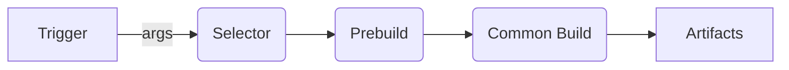

# Overview

## Build Pipeline

### Trigger
An external call to run a build.

### Selector
* Validates options(args);
* Select which build process to run;

### Prebuild
Custom prebuild module that runs actions to generate entrypoint and necessary files

### Common Build
Module that runs azion common build. Polyfills can be used to generate the worker(s) file(s).

### Artifacts
Files generated to run in azion structure:
* js worker(s);
* Storage assets files;

## A. Selector
To do.

## B. Prebuild
To do.

## C. Common Build
To do
