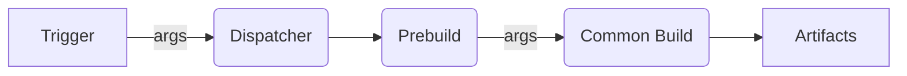

# Overview

## Build Pipeline

### Trigger
An external call to run a build.

### Dispatcher
* Receive build options(args);
* Select which build process to run;
* Load necessary template files and import correct modules (prebuild and configs);

### Prebuild
Custom prebuild module that runs actions to generate entrypoint and necessary files.

The user is free to run any action in this step. All actions must be called in a exported `main` function.

### Common Build
Module that runs azion common build.

Polyfills can be used to generate the worker(s) file(s).

Some configs can be passed to the builder but if user tries to override `azion worker configs` this passed configs will be ignored.

### Artifacts
Files generated to run in azion structure:
* js worker(s);
* Storage assets files;
