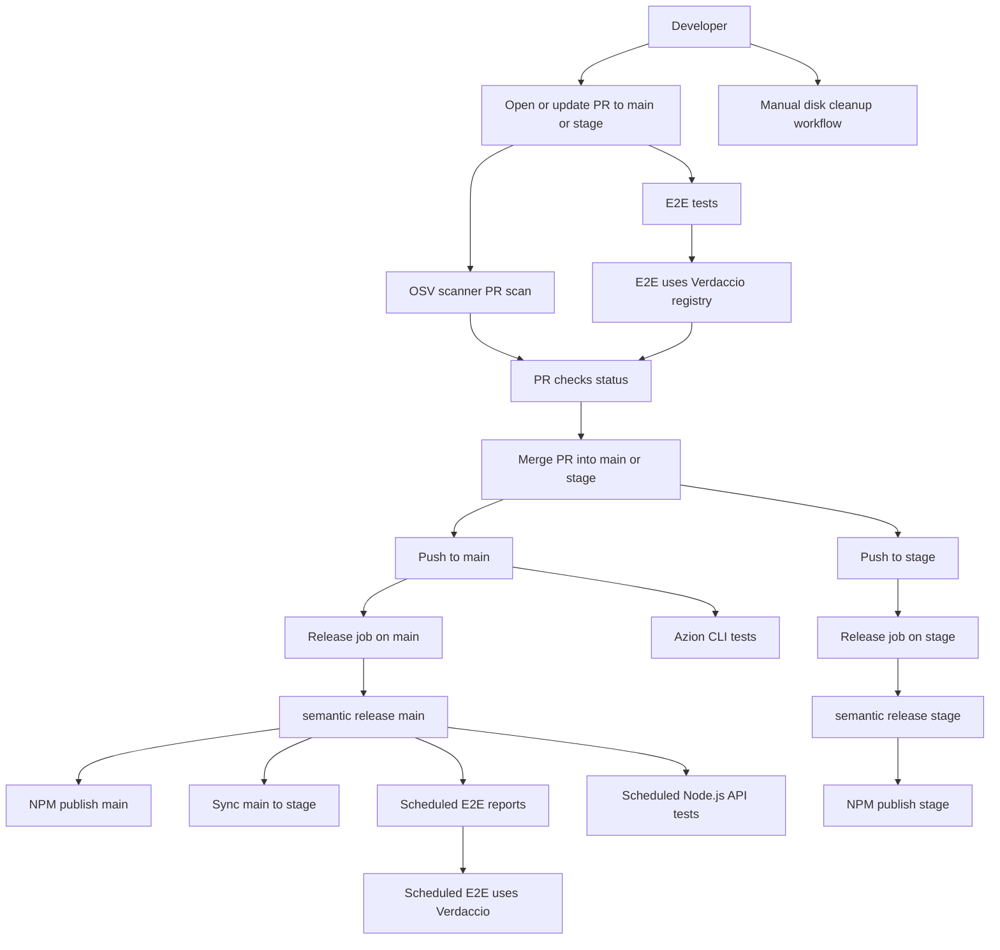

# PR to Release / Deploy Workflow

Below is a mermaid diagram and textual description derived from the workflows in `.github/workflows` of this repo.

---

## Diagram

---

## Step-by-step flow

### 1. From code change to PR

- **Developer creates branch**
  - Create a feature branch from `main` or `stage`.
  - Commit and push changes.

- **Open / update PR**
  - Open a PR targeting `main` or `stage` (or the PR enters a merge queue as a `merge_group` event).

### 2. PR validation

Triggered by `pull_request` (and `merge_group`) to `main` or `stage`:

- **OSV-Scanner PR Scan (`osv-scanner-pr.yml`)**
  - Runs `google/osv-scanner-action` reusable workflow.
  - Scans dependencies for known vulnerabilities.
  - Reports results as security events / SARIF in the Security tab.

Triggered by `pull_request` to `main` or `stage` (opened, synchronized, reopened):

- **E2E Tests (`test-e2e.yml`)**
  - Skips if the branch is a `dependabot/*` branch.
  - Steps:
    - Checkout repo.
    - `yarn install`.
    - Install Docker Compose.
    - Start local infrastructure (including Verdaccio registry) via Docker Compose.
    - Run `yarn test:e2e` against the Verdaccio-backed environment.
  - Results appear as a status check on the PR.

**Outcome:** The PR should only be merged once both OSV scan and E2E tests (plus any other required checks / reviews) pass.

### 3. Merge to main or stage

- **Merge PR**
  - When reviews and checks pass, merge the PR into `main` or `stage`.
  - This causes a `push` event on the target branch.

### 4. Push-triggered release pipeline (deploy)

Triggered by `push` to `main` or `stage`:

- **Release (`release.yml` – `release` job)**
  - Runs on both `main` and `stage`.
  - Steps:
    - Checkout with full history (and `CUSTOM_GITHUB_TOKEN`).
    - Setup Node.js (LTS).
    - `yarn install`.
    - `yarn build`.
    - `npx semantic-release` with:
      - `GITHUB_TOKEN = CUSTOM_GITHUB_TOKEN`.
      - `NPM_TOKEN / NODE_AUTH_TOKEN` for publishing.
  - **Effect:**
    - Creates GitHub releases / tags according to commit messages.
    - Publishes new package versions to the NPM registry (using the configured tokens), including publishing into Verdaccio when used in the CI environment.
    - This is effectively the “deploy/release” step for this library.

Triggered by `push` to `main` only:

- **AzionCli tests (`azioncli-test.yml`)**
  - Runs additional CLI tests using `tests/azion_cli/test.sh`.
  - Uses `AZION_USERNAME`, `AZION_PASSWORD`, and `WEBHOOK_SLACK_URL` secrets.
  - Validates integration with Azion CLI after merging into `main`.

### 5. Automatic main → stage sync

Within `release.yml`:

- **`sync-stage` job**
  - Runs only when:
    - `github.ref == 'refs/heads/main'`, and
    - First commit author is **not** `Azion Bundler Reports` (avoids loops from bot commits).
  - Steps:
    - Check out the repo.
    - Configure git user.
    - `git fetch origin`.
    - `git pull origin main`.
    - `git checkout stage`.
    - `git merge main --allow-unrelated-histories --no-edit -Xtheirs -m "Merge branch 'main' into stage [skip ci]"`.
    - `git push origin stage`.
  - **Effect:** Keeps `stage` branch aligned with `main` automatically after a release.

---

## Scheduled post-merge quality jobs (not directly on PR)

These run from `main` / `stage`, but are scheduled, not on each merge:

- **Report Generation (`test-e2e-reports.yml`)**
  - Trigger: `schedule` at `30 2 * * *` (02:30 UTC daily).
  - Requires `github.ref` to be `refs/heads/main` or `refs/heads/stage`.
  - Steps:
    - Checkout, install dependencies.
    - Install Docker Compose.
    - Run `yarn test:e2e`.
    - Update `README.md` with reports and push as `Azion Bundler Reports`.

- **Test Node.js APIs (`test-nodejs-apis.yml`)**
  - Trigger: `schedule` at `30 3 * * *` (03:30 UTC daily).
  - Requires `github.ref` to be `refs/heads/main` or `refs/heads/stage`.
  - Steps:
    - Checkout, install dependencies.
    - Install Docker Compose.
    - Run `yarn test:nodejs-apis`.
    - Update `docs/nodejs-apis.md` and push as `Azion Bundler Reports`.

These jobs keep documentation and reports up-to-date, but are not part of the synchronous PR → deploy path.

---

## Utility workflow

- **Manual Disk Cleanup (`manual-cleanup.yml`)**
  - Trigger: `workflow_dispatch` with inputs `clean_docker`, `clean_packages`, `clean_system`, `clean_build`.
  - Cleans:
    - Docker resources.
    - npm/yarn/pnpm caches.
    - System tool directories, apt cache.
    - Optional build artifacts (`dist`, `node_modules/.cache`, test result JSONs).
  - Helps recover disk space in CI; not part of the release flow itself.
