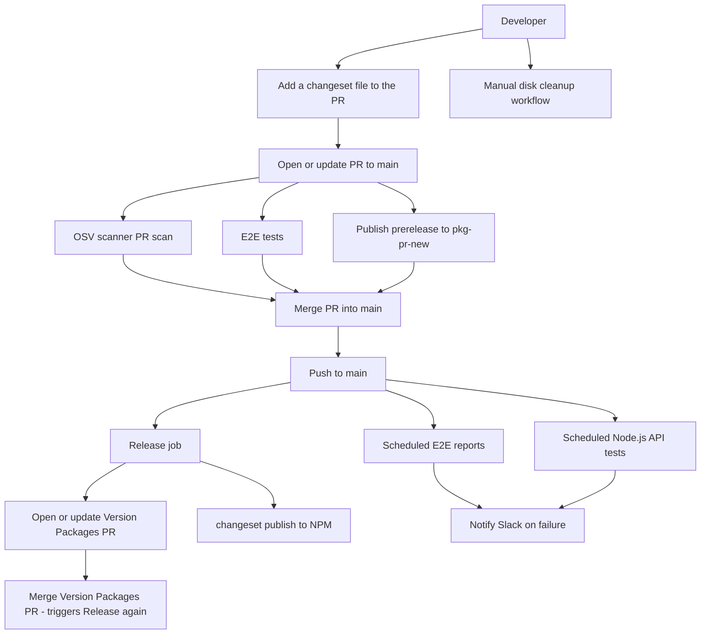

# PR to Release Workflow

Below is a mermaid diagram and textual description derived from the workflows in `.github/workflows` of this repo.

We use [Changesets](https://github.com/changesets/changesets) to manage versioning and releases — everything flows through PRs into `main`.

---

## Diagram

```mermaid
flowchart TD
    Dev[Developer]

    Dev --> Changeset[Add a changeset file to the PR]
    Changeset --> PR[Open or update PR to main]

    PR --> OSV[OSV scanner PR scan]
    PR --> E2E[E2E tests]
    PR --> Prerelease[Publish prerelease to pkg-pr-new]

    OSV --> Merge[Merge PR into main]
    E2E --> Merge
    Prerelease --> Merge

    Merge --> PushMain[Push to main]
    PushMain --> Release[Release job]

    Release --> VersionPR[Open or update Version Packages PR]
    Release --> Publish[changeset publish to NPM]

    VersionPR --> MergeVersionPR[Merge Version Packages PR - triggers Release again]

    PushMain --> SchedE2E[Scheduled E2E reports]
    PushMain --> SchedNode[Scheduled Node.js API tests]
    SchedE2E --> Slack[Notify Slack on failure]
    SchedNode --> Slack

    Dev --> ManualCleanup[Manual disk cleanup workflow]
```

---

## Step-by-step flow

### 1. From code change to PR

- **Developer creates a branch** off `main`, commits changes.
- **Add a changeset**: run `pnpm changeset` and describe the change (patch/minor/major) for each affected package. This creates a markdown file under `.changeset/`.
- **Open a PR targeting `main`**. The changeset file(s) are part of the PR diff.

### 2. PR checks

Triggered by `pull_request` to `main`:

- **OSV-Scanner PR Scan (`osv-scanner-pr.yml`)**
  - Runs the `google/osv-scanner-action` reusable workflow.
  - Scans dependencies for known vulnerabilities and reports as SARIF in the Security tab.

- **E2E Tests (`test-e2e.yml`)**
  - Skips `dependabot/*` branches.
  - `pnpm install`, install Puppeteer/Chrome and Docker Compose, run `pnpm -F @aziontech/bundler test:e2e`.

- **Publish prereleases (`prereleases.yml`)**
  - Skips PRs opened by `changesets/action` (branch `changeset-release/*`).
  - Detects changed packages via `changeset status`, builds them, and publishes a prerelease build of each to [pkg-pr-new](https://github.com/stackblitz-labs/pkg.pr.new) so reviewers can install and test the PR's exact build.

**Outcome:** merge only once required checks and reviews pass.

### 3. Merge to main

Merging the PR triggers a `push` to `main`.

### 4. Release pipeline (`release.yml`)

Triggered by `push` to `main`. Uses `changesets/action`, which behaves differently depending on whether there are unreleased changesets:

- **If there are unreleased changeset files:**
  - Opens (or updates) a PR named "Version Packages" that bumps versions, updates `CHANGELOG.md`s, and removes the consumed changeset files.
  - This PR is reviewed and merged like any other PR — merging it triggers `release.yml` again.

- **If there are no unreleased changesets (i.e. a Version Packages PR was just merged):**
  - Runs `pnpm exec changeset publish`, which publishes the new package versions to NPM and creates the corresponding GitHub tags/releases.

So a real release always takes two merges to `main`: the feature PR (with its changeset) and the auto-generated Version Packages PR.

### 5. Scheduled post-merge quality jobs

These run on a schedule from `main` (not on every merge), and post to Slack on failure via `.github/actions/notify-slack`:

- **Report Generation (`test-e2e-reports.yml`)** — daily at 02:30 UTC. Runs `test:e2e` and notifies Slack via `SLACK_WEBHOOK_URL` on failure.
- **Test Node.js APIs (`test-nodejs-apis.yml`)** — daily at 03:30 UTC. Runs `test:nodejs-apis` and notifies Slack on failure.

These keep quality signal fresh but are decoupled from the PR → release path.

---

## Utility workflow

- **Manual Disk Cleanup (`manual-cleanup.yml`)**
  - Trigger: `workflow_dispatch` with inputs `clean_docker`, `clean_packages`, `clean_system`, `clean_build`.
  - Cleans Docker resources, npm/yarn/pnpm caches, system tool directories/apt cache, and optionally build artifacts (`dist`, `node_modules/.cache`, test result JSONs).
  - Helps recover CI disk space; not part of the release flow itself.
